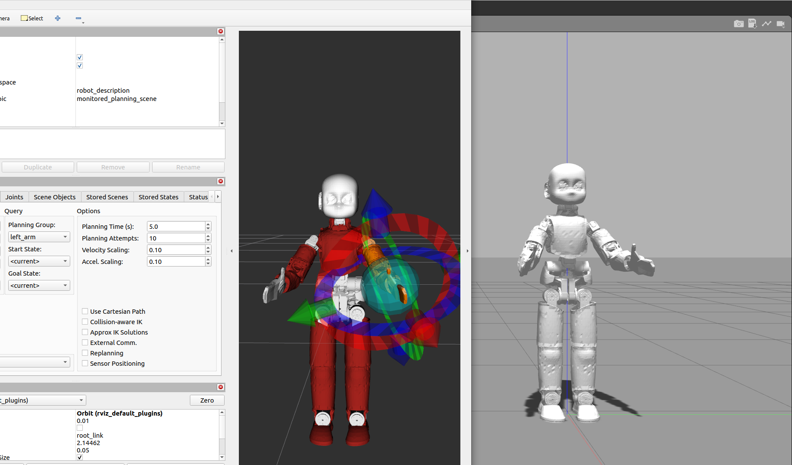
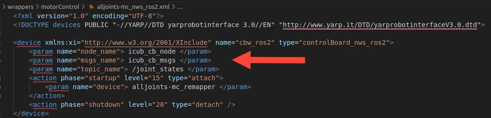
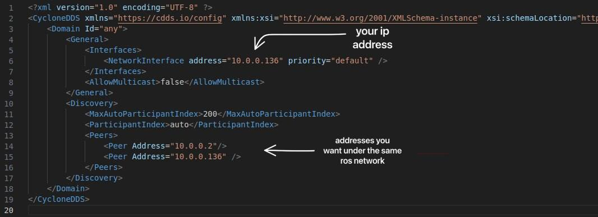

xcub-moveit2
=============

<div align = "center">
    
</div>

## Maintainer

| | |
|:---:|:---:|
| [](https://github.com/martinaxgloria) | [@martinaxgloria](https://github.com/martinaxgloria) |

## Overview

This repository contains the current state of the ROS2 packages for using iCub and ergoCub with MoveIt.

## Assumptions

These packages were generated and tested with `ros humble` distro on a `Ubuntu 22.04` machine.

## Prerequisites and dependencies

First of all, install [ROS 2 Humble](https://docs.ros.org/en/humble/Installation/Ubuntu-Install-Debians.html) on your machine and configure your [ROS 2 environment](https://docs.ros.org/en/humble/Tutorials/Beginner-CLI-Tools/Configuring-ROS2-Environment.html#configuring-environment). Then, follow the [MoveIt 2 install guide](https://moveit.ros.org/install-moveit2/binary/) to build all the necessary dependencies.

Moreover, it is mandatory to install `yarp-devices-ros2` on your machine to use custom ROS messages and services defined in [yarp_control_msgs](https://github.com/robotology/yarp-devices-ros2/tree/master/ros2_interfaces_ws/src/yarp_control_msgs):

```shell
# Clone the repository in your workspace
git clone https://github.com/robotology/yarp-devices-ros2

# Build ROS msgs and compile the colcon workspace
cd yarp-devices-ros2/ros2_interfaces_ws
colcon build
source install/setup.bash

# Compile yarp-devices-ros2 specifying the installation path
cd ..
mkdir build && cd build
cmake .. -DCMAKE_INSTALL_PREFIX=<install_prefix>
make
make install
```

This repository contains some devices and custom ROS2 interfaces with different purposes and, in particular for this application, it contains the possibility to control a `yarp-based` robot with ROS2. To enable this features, you have to add the `msgs_name` parameter in your configuration file that inizializes the device `controlBoard_nws_ros2`, for example:



Finally, [TRAC-IK](https://traclabs.com/projects/trac-ik/) is chosen as inverse kinematics solver. It is more accurate and faster when dealing with complex kinematic chains with respect to KDL Kinematics, which represents the standard for MoveIt 2. To install it inside your ROS2 workspace:

```shell
cd ~/<ros2_ws>/src
source /opt/ros/humble/setup.bash

# Clone the repository inside your ros2 workspace and build it
git clone https://bitbucket.org/traclabs/trac_ik.git -b rolling-devel
cd trac_ik
colcon build
source install/setup.bash
```

> **_NOTE:_** If you don't want to source your ros humble setup file each time a new shell is open, you can add this command in your `.bashrc`:
> ```shell
> echo "source /opt/ros/humble/setup.bash" >> ~/.bashrc
> ```

## Install

This section describes how to install and build the packages contained in this repository.

In your ROS2 workspace, clone the repo:

```shell
cd ~/<ros2_ws>/src
git clone https://github.com/icub-tech-iit/xcub-moveit2
```

and then build the environment:

```shell
cd ..
source /opt/ros/humble/setup.bash 
colcon build
source install/setup.bash
```

## Usage on real hardware

If you want to control a yarp-based robot (like iCub) using the proposed framework, you have to make sure that your machine is in communication with the robot one on which ros2 is installed. For this reason, be sure that your laptop and the robot machine are on the same network:

- configure your [yarpserver](https://www.yarp.it//v3.5/yarp.html#yarp_conf) as to be the one running on the robot environment;
- after checking your ip address and the robot one, customize the `cyclonedds.xml` file in this repository as follow:
  

- export this configuration file in the `.bashrc` in order to be used by `Cyclone DDS`:

```
export CYCLONEDDS_URI=/<path/to/your/ros2_ws>/src/xcub-moveit2/cyclonedds.xml
```
- repeat the last two steps on the robot machine, changing the ip address accordingly.


However, if you want to work in simulation instead of on the real hardware, you can skip the list above.

## Package description

This section aims to give a brief description of what each package contains.

### robot_controller

This package contains `robot_controller` plugin that is used in [ros2_control](https://control.ros.org/master/index.html) framework. It includes:

- a `position state interface` used to read the position of each joint;
- a `velocity state interface` used to read the velocity of each joint;
- a `position command interface` used to forward the desired position to the joints.

### robot_moveit

This package contains some launch files, depending on the nodes you want to run.

- **`robot.launch.py`**: it allows to start up a set of nodes to bringup the robot. It spawns the model on `rviz`, publishes the state of the robot to `tf2` topic and starts the [move_group](https://moveit.picknik.ai/main/doc/concepts/move_group.html) node, which provides some ROS actions and services for using MoveIt 2 with your robot.
- **`robot_sim.launch.py`**: it's the same as before, but it spawns the model also in `gazebo` environment to work with the simulated robot.
- **`robot_controls.launch.py`**: this launch file allows to run the `controller manager` node for ros2_control and the nodes for the single controllers (one for each part).
- **`circle_demo.launch.py`** and **`grasp_demo.launch.py`**: as the name suggests, they are two examples of commanding the robot in the cartesian space using `torso + right_arm` as planning group.


Before running the nodes, make sure that your environment variable `YARP_ROBOT_NAME` is properly set with the name of your robot. If not, set it for each shell according to the chosen model, for example:

```shell
export YARP_ROBOT_NAME="icub"
```

### icub_moveit_config

This package contains the configuration files to make iCub working with MoveIt2. In particular, each of the parts of iCub robot (head, left_arm, right_arm, torso, left_leg and right_leg) are defined in terms of `planning group`, and for each of them a ros2_control of type `FollowJointTrajectory` is set.

### ergocub_moveit_config

It contains the same information described in the previous paragraph, but customized with ergoCub specs.

### test_controller

In this folder, a test to sample the reaching space is available. It can be run as a ros2 node with the provided launch file called `test_controller.launch.py`. For this purpose, you can find more info in the [Use case](#use-case) paragraph above.

Moreover, a detailed report about the controller performance can be found [here](https://github.com/icub-tech-iit/xcub-moveit2/blob/master/test_controller/README.md#test-on-the-controller-performance) 📝.

## Use case

### Run the demos

As described in the previous section, this repository contains two demos that show the possibility to control a yarp-based robot within the MoveIt2 framework in the Cartesian space. First of all, make sure that `yarpserver` is running on your machine. Then, you can start launching a basic simulation:

```shell
# Build the packages within your ros2 workspace
cd ~/<ros2_ws>
source /opt/ros/humble/setup.bash 
colcon build
source install/setup.bash

# Remember to check if your robot name variable is set. If not:
export YARP_ROBOT_NAME="icub"

# Launch the start-up nodes
ros2 launch robot_moveit robot_sim.launch.py
```

In this way, both rviz2 and gazebo windows are opened with the iCub model spawned in the two environments. At this point, open another shell, build and source the enviroment and then launch the ros2_control nodes:

```shell
cd ~/<ros2_ws>
source /opt/ros/humble/setup.bash 
colcon build
source install/setup.bash
export YARP_ROBOT_NAME="icub"

# Launch the ros2_control nodes
ros2 launch robot_moveit robot_controls.launch.py
```

To verify that everthing has been done successfully, you can run in a separate shell:

```
ros2 control list_controllers
```
Here, you should see all the controllers loaded and their state (i.e. active or inactive).

Finally, open another shell and run the chosen demo, for example:

```shell
cd ~/<ros2_ws>
source /opt/ros/humble/setup.bash 
colcon build
source install/setup.bash
export YARP_ROBOT_NAME="icub"

# For the grasping demo
ros2 launch grasp_moveit grasp_demo.launch.py
```

If you want to see iCub performing a circle movement, instead of the last line, you can run:

```shell
ros2 launch robot_moveit circle_demo.launch.py
```

and follow the instructions on the third shell you opened.
You should have something like this:

<video src="assets/circle.mp4" controls title="Demos"></video>


### Controller performance

If you want to test the ros2_control `robot_controller` performance, you can rely to the `test_controller` package. It contains a simple script to sample the reaching space in front of iCub model. To run the simulation, please follow the first two steps described in the [Run the demos](#run-the-demos) section. After that, open another shell, source your workspace and then launch:

```shell
ros2 launch test_controller test_controller.launch.py
```

In this way, the test will start and the acquired data in terms of ideal and real poses are saved in two separated files in your current directory. Finally, you can plot them using the Matlab scripts provided in the `utils` folder.