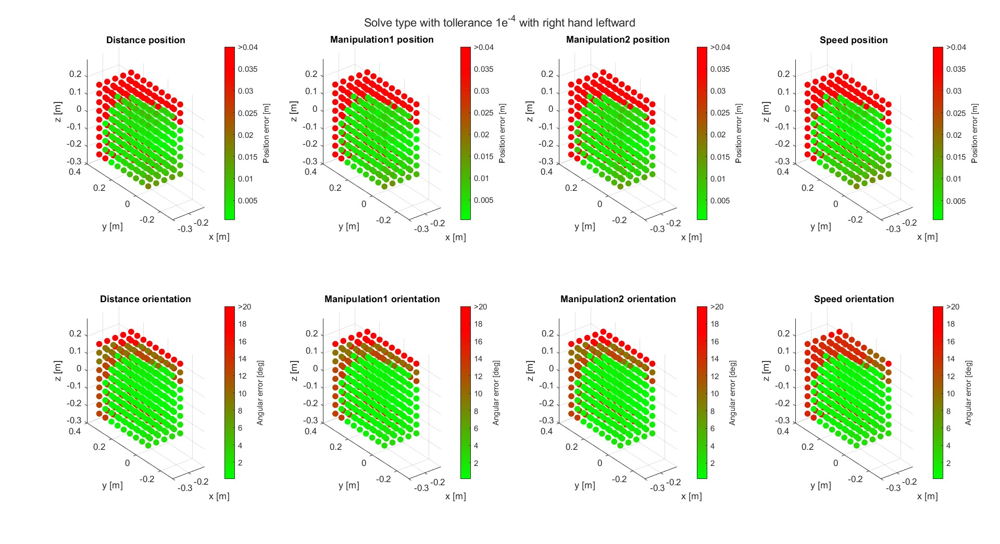

# Test on the controller performance

The following report describes the design of the test and the procedures adopted to sample the iCub workspace using ros2_control and MoveIt2 tools.
- [Test on the controller performance](#test-on-the-controller-performance)
    - [1. Identify the workspace](#1-identify-the-workspace)
    - [2. Choose the orientation](#2-choose-the-orientation)
    - [3. Tuning TRAC-IK parameters](#3-tuning-trac-ik-parameters)
      - [3.1 Change `epsilon` values with fixed `solve_type`](#31-change-epsilon-values-with-fixed-solve_type)
      - [3.2 Change `solve_type` values with chosen `epsilon`](#32-change-solve_type-values-with-chosen-epsilon)
    - [4. Results](#4-results)
 
⚠ **Important note**

These tests were carried out in a simulated environment using `iCubGazeboV2_5 feet fixed` model. Moreover, the parts involved are `torso + right_arm`, with `right_hand` as the end-effector to be controlled in the Cartesian space.
 
### 1. Identify the workspace
The very first thing we took into account was the portion of space to be analyzed. In this sense, starting from what was done in the past (see [here](https://github.com/robotology/icub-workspace-estimation) for reference), we decided to focus on the poses in front of the robot, usually involved in reaching tasks.
 
Considering the iCub `root_link` reference frame:

we defined the workspace limits as follow:

- x direction: `[-0.3; -0.1] m`;
- y direction: `[-0.1; 0.3] m`;
- z direction: `[-0.2; 0.2] m`;

The spatial step chosen for this analysis was of `0.05 m` for each direction.

### 2. Choose the orientation
Once we decided the portion of space to be sampled, we focused on the orientation. To narrow down the analysis, we decided to select only two orientations per position:

- `palm down`
- `palm oriented leftward`

### 3. Tuning TRAC-IK parameters
[`TRACK-IK`](http://docs.ros.org/en/kinetic/api/moveit_tutorials/html/doc/trac_ik/trac_ik_tutorial.html) is the inverse kinematics solver chosen for the `ros2_control` implemented in this repository. 

The available parameters for this solver are:

- `epsilon`: Cartesian error distance used to determine a valid solution. It is `1e-5` by default;
- `position_only_ik`: it's `false` by default. If it's set to true, the solver will ignore the orientation with respect to the position;
- `solve_type`: it can be `Speed`, `Distance`, `Manipulation1` or `Manipulation2` (see [documentation](https://bitbucket.org/traclabs/trac_ik/src/rolling-devel/trac_ik_lib/) for details).

Since we were interested in both position and orientation, `position_only_ik` remained set to `false` for every test.

In order to understand which are the best parameters for our application, the workspace sampling test was repeated each time with a different combination of them. Moreover, for each repetition, the ideal poses and the current (real) ones were acquired to compute the error between the two.

#### 3.1 Change `epsilon` values with fixed `solve_type`
The first analysis examined the impact of the `epsilon` parameter. In this sense, we decided to stay on a fixed `solve_type` (`Manipulation1` in this specific case), and change the Cartesian error distance in increments of 10.

The first thing that stood out was that with a very low value (i.e. 1e-6), it resulted in large errors from both position and orientation points of view. Concerning the other three cases, instead, no significant differences were observed; for this purpose, we decided to go with the middle value, which is `epsilon = 1e-4`.

#### 3.2 Change `solve_type` values with chosen `epsilon`
Once the first parameter was tuned, we moved to the `solve_type`. We repeated the same test described above for the four available types and here it is was we obtained:

Even in this case, there was one case between the proposed that was significantly different from the others: the results used `Speed` were the worst if compared with the other plots, so we excluded it. `Distance`, `Manipulation1` and `Manipulation2`, instead, were very similar each others but we took the former since, as described in the documentation, it is not dependent on the singular values of the Jacobian.

### 4. Results
To summarize, the tuning of the TRAC-IK parameters resulted in:

- `epsilon = 1e-4`;
- `position_only_ik = false`;
- `solve_type = Distance`

Once we chose the best of those parameters, we repeated the test one last time for both the orientations taken into account (see [Section 2](#2-choose-the-orientation)), and we plotted the results in terms of position and orientation error between the set pose and the obtained one.

